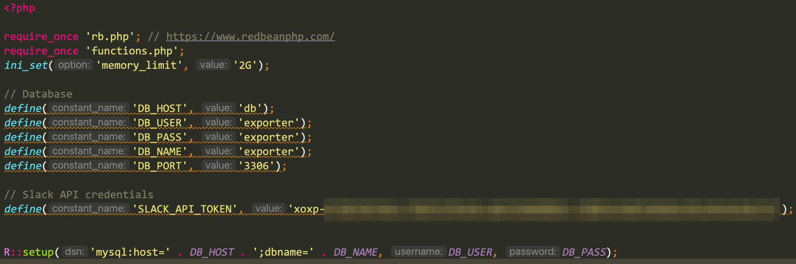

# Slack Exporter

This tool pulls Slack's users, channels (info, members, bookmarks), emojis, messages, reactions, and files into local file system and database.

# Table of Contents

- [Excuses First](#excuses-first)
- [Basic Information](#basic-information)
  - [What this tool does](#what-this-tool-does)
  - [What it does not (yet)](#what-it-does-not-yet)
- [Setup](#setup)
  - [System Requirements](#system-requirements)
  - [Create a Slack App](#create-a-slack-app)
    - [Step 1: Sign into Slack](#step-1-sign-into-slack)
    - [Step 2: Get into the desire workspace and obtain your organization ID](#step-2-get-into-the-desire-workspace-and-obtain-your-organization-id)
    - [Step 3: Create a new Slack app](#step-3-create-a-new-slack-app)
    - [Step 4: Enable needed permissions for the new app](#step-4-enable-needed-permissions-for-the-new-app)
    - [Step 5: Install the app to your workspace](#step-5-install-the-app-to-your-workspace)
    - [Step 6: Spin up your environment](#step-6-spin-up-your-environment)
    - [Step 7: Configurations](#step-7-configurations)
- [Usage](#usage)
  - [Get into your Docker container](#get-into-your-docker-container)
  - [Pull everything](#pull-everything)
  - [Pull only what you want](#pull-only-what-you-want)
  - [Find the pulled data](#find-the-pulled-data)
    - [Database](#database)
    - [Files](#files)

# Excuses First

When writing this tool, I tried to spend least time and effort. The first priority was making it work as intended in a minimum amount of time. Therefore, the code is *nasty*! Please bear with it!

# Basic Information

## What this tool does

* Pull users in a organization into database as well as downloading their avatars into local file system
* Pull Slack's emojis and your organization's custom emojis into database as well as downloading the custom emojis into local file system
* Pull information, members, and bookmarks of channels, chat groups, and direct chats into database
* Pull messages into database and download files associated to messages into local file system
* Pull reactions to messages

## What it does not (yet)

At the moment, the tool can only pull information into database and download files/emojis into local file system. It does not provide a UI to display or search for messages and files. The top priority for now is pulling information to local storage.

# Setup

## System Requirements

* PHP 7.0+
* Apache or Nginx
* MySQL or MariaDB

## Create a Slack App

In order to connect to Slack API, you need to create an app. The following guide shows you how to create a Slack app.

### Step 1: Sign into Slack

Go to [https://slack.com/signin](https://slack.com/signin) and sign into your Slack account if you're not signed in.

### Step 2: Get into the desire workspace and obtain your organization ID

After signing in, you will see a list of your workspaces as below:


Click on a workspace where you want to pull stuff from. This is a **mandatory** step!

If your web browser shows the below popup, feel free to click on **Cancel** button:


### Step 3: Create a new Slack app

Go to [https://api.slack.com/apps](https://api.slack.com/apps) then click on **Create New App** button:


Click on **From scratch**:


Fill in the app name, choose the desire workspace, then click on **Create App** button:


You'll then be redirected to the page as below:


### Step 4: Enable needed permissions for the new app

Click on **OAuth & Permissions** on the left sidebar:


Scroll to Scopes section. Click on the **Add an OAuth Scope** button under **User Token Scopes**, NOT *Bot Token Scopes*:


Find the following scopes and click on each of them:

* bookmarks:read
* channels:history
* channels:read
* emoji:read
* files:read
* groups:history
* groups:read
* identify
* im:read
* mpim:read
* reactions:read
* search:read
* usergroups:read
* users:read

Once completed, the page should look like below:


### Step 5: Install the app to your workspace

On the same page at Step 4, scroll up to the **OAuth Tokens for Your Workspace** section. Click on the **Install to Workspace** button.


Click on the **Allow** button:


You'll be redirected to the previous page. This time, you'll see a User OAuth Token as below:


You'll need the token later on.

**Note:** If you make any changes in the scopes, you'll need to click on the **Reinstall to Workspace** button to refresh the app permissions

**WARNING:**


**Treat the User OAuth Token as password! DO NOT PROVIDE IT TO ANYONE! Anyone having this token will be able to see all of your private messages!**

### Step 6: Spin up your environment

As long as your computer has the required software in the **System Requirements** section above, you can just put the code into any folder on your computer then you're ready to run it.

**Using Docker? You're more than welcome!**

```
cd /path/to/slack_exporter_tool
docker compose up -d
```

### Step 7: Configurations

Make a copy of the file `config.example.php` in the same folder and name the new file to `config.php`. Edit `config.php` and set the following values:

* `DB_HOST`: your database host address, or `db` if you go with Docker.
* `DB_USER`: your database username, or `exporter` if you go with Docker.
* `DB_NAME`: your database name, or `exporter` if you go with Docker.
* `DB_PASS`: your database password, or `exporter` if you go with Docker.
* `SLACK_API_TOKEN`: this is the User OAuth Token that you've obtained on Step 5. It usually starts with `xoxp-`.

Your `config.php` should look like below:


# Usage

This tool runs via command-line interface only.

## Get into your Docker container

```
docker exec -it slack_exporter_tool_app bash
cd /var/www/html
```

The below instruction assumes you've already been in the Docker container CLI.

## Pull everything

```
sh pullAll.sh
```

## Pull only what you want

If you only want to pull certain things, you can choose to run any of the following commands:

* `php pullUsers.php`: pull information of all user in the organization, including their avatars
* `php pullEmojis.php`: pull information of all emojis as well as downloading the custom ones
* `php pullConversations.php`: pull information of all channels, chat groups, and direct chats
* `php pullConversationBookmarks.php`: pull all bookmarks of all channels, chat groups, and direct chats
  * Note: This requires `php pullConversations.php` to be run first.
* `php pullConversationMembers.php`: pull all members of all channels, chat groups, and direct chats
  * Note: This requires `php pullConversations.php` to be run first.
* `php pullMessages.php`: pull all messages from all channels, chat groups, and direct chats
  * Note: This requires `php pullConversations.php` to be run first.
* `php pullReactions.php`: pull all reactions to all messages

## Find the pulled data

### Database

You can use any database administration tool to view the pulled data.

If you go with Docker, it comes with phpMyAdmin. You can go to [http://localhost:61000/](http://localhost:61000/) and login with `exporter` as Username and Password:


### Files

* User avatars: stored on the folder `avatars`
* Custom emojis: stored on the folder `emojis`
* Files attached to messages: stored on the folder `files`

